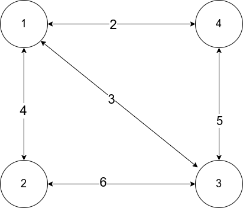

### Distance Vector Algorithm

#### Input


##### Cost Matrix
```
     |   1 |   2 |   3 |   4 |
     -------------------------
  1  |   0 |   4 |   3 |   2 |
  2  |   4 |   0 |   6 | 999 |
  3  |   3 |   6 |   0 |   5 |
  4  |   2 | 999 |   5 |   0 |
```

#### Output
```txt
% ./dv
Enter number of nodes:4
Enter the cost matrix:
0 4 3 2
4 0 6 999
3 6 0 5
2 999 5 0

Routing Cost for Each Router is as below

Routing Cost for Router 1 is
Node     From    Cost
1        1       0 
2        2       4 
3        3       3 
4        4       2 

Routing Cost for Router 2 is
Node     From    Cost
1        1       4 
2        2       0 
3        3       6 
4        1       6 

Routing Cost for Router 3 is
Node     From    Cost
1        1       3 
2        2       6 
3        3       0 
4        4       5 

Routing Cost for Router 4 is
Node     From    Cost
1        1       2 
2        1       6 
3        3       5 
4        4       0 

%
```